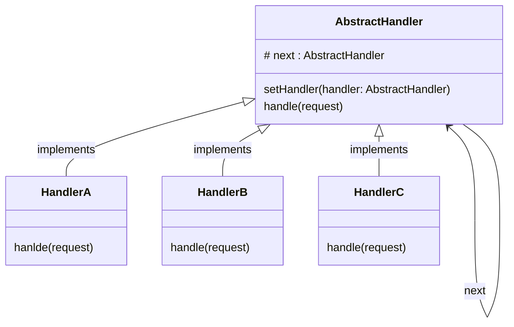

# Chain of Responsibility

### Type: Behavioral

## Introduction

&nbsp;In object-oriented design, the chain-of-responsibility pattern is a behavioral design pattern consisting of a source of command objects and a series of processing objects.Each processing object contains logic that defines the types of command objects that it can handle; the rest are passed to the next processing object in the chain. A mechanism also exists for adding new processing objects to the end of this chain.<br>
&nbsp; All of the classes on the chain inherit from an abstract Handler base class that will provide the chain behavior. In order to do so, the abstract class must has a protected attribute next that will store the next class on the chain and a method to set this attribute.This abstract class implements a similar logic as the Linked List data structure.
&nbsp; This pattern can be used in different ways, for example: 
* Each of the Concrete Handler classes can be responsible to treat a part of the request.
* Each of the Concrete Handler classes acts like an if statement, if a handler can't handle the request, it calls the next handler on the chain. 
&nbsp; The Chain of Responsibility pattern can use a class to define the order of the chain or can transfer this responsibility to the Client Code. 

## Advantages

1. Increase the request processing new class of very convenient.

2. To reduce the coupling degree. Decoupling it will request the sender and receiver.

3. Applies the SRP (Single Responsibility Principle).

4. Applies the OCP (Open/Closed Principle).

5. It's easy to add a new process on the chain or even re-order the chain. 

## Disadvantages

1. Add more complexity to the code.

## Pattern Diagram


## Our Python example


### Introduction

The program simulates a message sent as request by the user.In this program the message will only be display if the user is classified as Super and if the user send the token and the message in the request.


#### AbstractHanlder

1. Create the abstract handler class to the specif request. (abstract_handler.py)

```py
from __future__ import annotations
from abc import ABC
from dataclasses import dataclass, field
from modules.program_classes import UserMessageRequest


@dataclass
class AbstractAccessHandler(ABC):
    
    _next: AbstractAccessHandler = field(init=False)
    
    def setNextHandler(self, handler: AbstractAccessHandler) -> AbstractAccessHandler:
        self._next = handler
    
    def handle(self, user_message: UserMessageRequest) -> UserMessageRequest:
        
        if self._next : return  self._next.handle(user_message)
        return user_message
        
```

#### Handlers

2. Create all the handlers subclasses to treat the request. (handlers.py)

```py
from modules.abstract_handler import AbstractAccessHandler
from modules.program_classes import UserMessageRequest, Role

class TokenAccessHandler(AbstractAccessHandler):
    
    def handle(self, user_message: UserMessageRequest) -> UserMessageRequest:
        if user_message.user.token : return self._next.handle(user_message)
        
        print('Not Access token provided')
        user_message.denied = True
        return user_message
    

class RoleAccessHandler(AbstractAccessHandler):
    
    def handle(self, user_message: UserMessageRequest) -> UserMessageRequest:
        if user_message.user.role == Role.SUPER : return self._next.handle(user_message)
        
        print('User does not have permission for this operation')
        user_message.denied = True
        return user_message


class MessageAccessHandler(AbstractAccessHandler):
    
    def handle(self, user_message: UserMessageRequest) -> UserMessageRequest:
        if user_message.message:  
            print('The following message was send:')
            print(user_message.message)
            return
        
        print('No Message was provided')
        user_message.denied = True
        return user_message
    

```

#### Program Classes

3. The program classes are the classes used in the request.(program_classes.py)

```py
from dataclasses import dataclass, field
from enum import Enum


class Role(Enum):
    
    USER = 0
    SUPER = 1
    

@dataclass
class User:
    
    username: str
    role: Role
    token: str = field(default_factory=str)


@dataclass
class UserMessageRequest:
    user : User
    message: str
    denied: bool = False
    
```


#### The Program

1. Instantiate an user (yan) with the role Super.
2. Instantiate an user message with the user yan, the token and the message.
3. Instantiates each of Handlers and creates a chain that verifies:
    * If the token has been sent in the request.
    * If the user has Super role.
    * If the message has been sent.
4. Uses the first hanlder on the chain to handle the user message request.
5. The program displays the user message, because the request successfully passed by all the hanlders.


```py
import uuid
from modules.handlers import ( 
    MessageAccessHandler, 
    RoleAccessHandler, 
    TokenAccessHandler
)
from modules.program_classes import Role, User, UserMessageRequest


if __name__ == '__main__':
    
    user = User('yan', role=Role.SUPER, token=uuid.uuid4())
    user_message = UserMessageRequest(user, 'This is just a test')
    
    token_handler = TokenAccessHandler()
    role_handler = RoleAccessHandler()
    message_handler = MessageAccessHandler()
    
    token_handler.setNextHandler(role_handler)
    role_handler.setNextHandler(message_handler)
    
    token_handler.handle(user_message)

```
