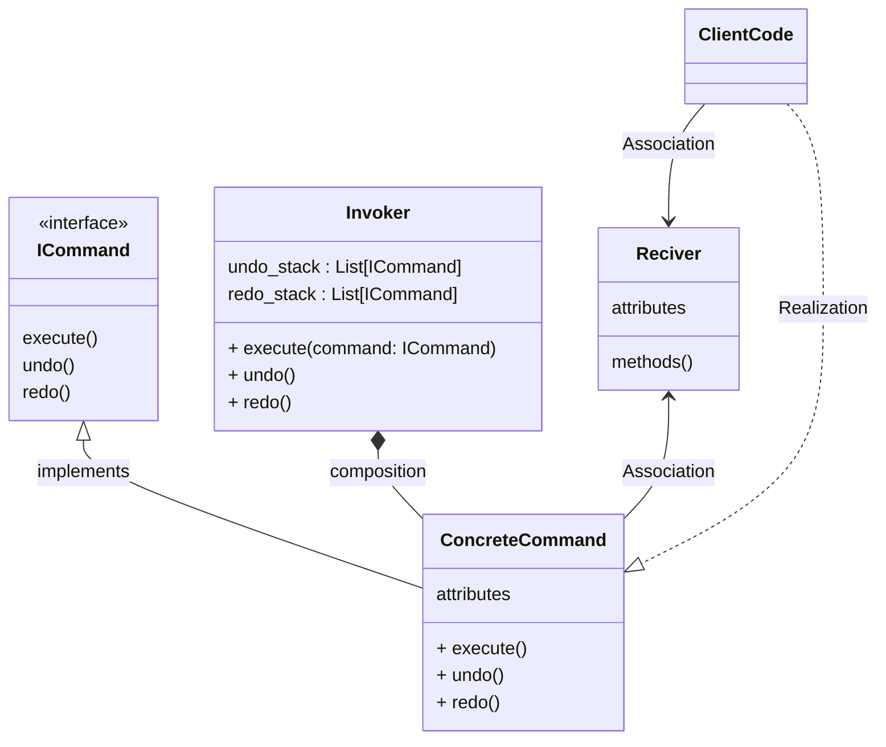

# Command

### Type: Behavioral

## Introduction

The Command pattern provides an encapsulation to a transaction or command that can be later invoked by an invoker object and will effect a reciver object. Neither the invoker nor the reciver need to know about the implementation details of each other.
In order to fully implement this pattern the command class must to provide a method to undo the command and the program must also provides to the client code a way to execute multiple methods together . 

## Advantages

1. Makes the creation of new commands simple.

## Disadvantages

1. Add more complexity to the code.

## Pattern Diagram

## Our Python example

#### Obs

* Python does not have interfaces, to workaround it.It's possible to use abstract classes or Protocols.This example uses Protocols. 

### Introduction

The program simulates a social network where an user can follow other users and send messages to them.


#### Command Protocol

1. Create the protocol that every command must follows. The command must has an execute method, a undo method to undo the command, and a redo method that can be used in a command that has been undone. (command_protocol.py) 

```
from dataclasses import dataclass
from typing import Protocol


@dataclass
class ICommand(Protocol):
    
    def execute(self) -> None: pass
    
    def undo(self) -> None: pass
    
    def redo(self) -> None: pass


```

#### Batch

2. Create a class to control a command batch. (batch.py)

```
from dataclasses import dataclass, field
from modules.command_protocol import ICommand


@dataclass
class Batch:
    commands: list[ICommand] = field(default_factory=list)

    def execute(self) -> None:
        completed_commands: list[ICommand] = []
        try:
            for command in self.commands:
                command.execute()
                completed_commands.append(command)
        except ValueError:
            for command in reversed(completed_commands):
                command.undo()
            raise

    def undo(self) -> None:
        for command in reversed(self.commands):
            command.undo()

    def redo(self) -> None:
        for command in self.commands:
            command.redo()

```

#### Invoker class

3. Create the invoker class that will be responsible to execute the commands.(invoker.py)

```
from dataclasses import dataclass, field
from typing import List

from modules.command_protocol import ICommand


@dataclass
class Invoker:
    undo_stack : List[ICommand] = field(default_factory=list)
    redo_stack : List[ICommand] = field(default_factory=list)

    def execute(self, command: ICommand) -> None:
        command.execute()
        self.redo_stack.clear()
        self.undo_stack.append(command) 
    
    def undo(self) -> None:
        if not self.undo_stack:
            return
        
        command = self.undo_stack.pop()
        command.undo()
        self.redo_stack.append(command)
    
    def redo(self) -> None:
        if not self.redo_stack:
            return
        
        command = self.redo_stack.pop()
        command.redo()
        self.undo_stack.append(command)
```

#### The Commands

Create a file with every command that the program needs. (commands.py)

```
from dataclasses import dataclass
from modules.reciver import User, Message

@dataclass
class Follow:
    
    follower: User
    followed: User
    
    def execute(self) -> None:
        self.follower.followings.append(self.followed)
        self.followed.followers.append(self.follower)
    
    def undo(self) -> None:
        self.follower.followings.pop()
        self.followed.followers.pop()
    
    
    def redo(self) -> None:
        self.execute()
        
        
@dataclass
class SendMessage:
    
    from_user: User
    to_user: User
    text: str
    
    def execute(self) -> None:
        message = Message(self.from_user, self.text)
        self.to_user.messages.append(message)
    
    def undo(self) -> None:
        self.to_user.messages.pop()
        
    def redo(self) -> None:
        self.execute()

```

### The Reciver

Create the class that will recive or be effect by a command. (reciver.py)

```
from __future__ import annotations
from dataclasses import dataclass, field
from typing import Optional, List

@dataclass
class Message:
    author: User
    text: str
    
    def __str__(self) -> str:
        return f'From: {self.author} => {self.text}'

@dataclass
class User:
    name: str
    messages: Optional(List[Message]) =  field(default_factory=list)
    followers : Optional(List[User]) =  field(default_factory=list)
    followings: Optional(List[User]) =  field(default_factory=list)

    def __str__(self) -> str:
        return self.name

```

#### The Program

1. Instantiate three users (yan, duda, john).
2. Instantiate an invoker object.
3. Uses the invoker to execute a Follow command that make the user yan follow the user duda.
4. Uses the invoker to undo the last command.
5. Uses the invoker to execute a batch of commands that makes john follow yan, and send a message from john to yan.
6. In the end, the prograg iterates through yan's messages, followers and followings. (followings => users that a user follows).

7.Output: 
* The program shows that yan doesn't follow anyone, because after execute the command that makes yan follow duda, the undo command is also executed.
* The program shows that john follows yan.
* The program shows the message that john sent to yan.

```
from modules.commands import SendMessage
from modules.batch import Batch
from modules.invoker import Invoker
from modules.reciver import User
from modules.commands import Follow

if __name__ == '__main__':
    
    yan = User('Yan')
    duda = User('Duda')
    john = User('John')
    invoker = Invoker()
    
    invoker.execute(Follow(follower= yan, followed= duda))
    # invoker.undo()
    
    invoker.execute( Batch ([
        Follow(follower=john, followed=yan),
        SendMessage(from_user=john, to_user=yan, text='Hello yan! I am john from HR, i just followed you can you follow me back? ')
    ])) 
    
    invoker.undo()
    invoker.redo()
    
    # Yan's Followers
    for follower in yan.followers:
        print(follower)
    
    # Yan's Followings
    for following in yan.followings:
        print(following)
        
    for message in yan.messages:
        print(message)

```
