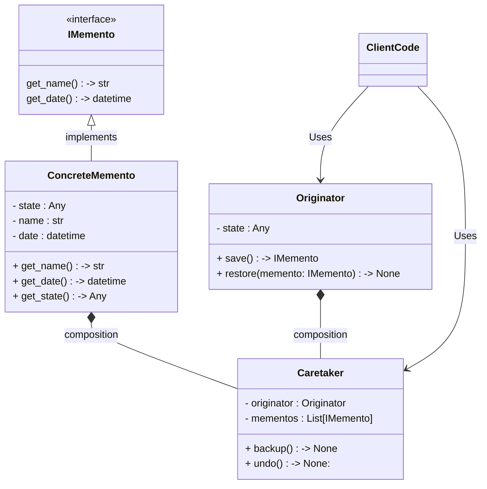

# Memento

### Type: Behavioral

## Introduction

&nbsp;Memento behavioral design pattern is used to restore state of an object to a previous state(object snapshots used to maintain state with memento object)

&nbsp; The memento pattern is implemented with three objects: the originator, a caretaker and a memento.<br>

* The originator is the product class (the class with the program business logic) and in order to follow the Memento pattern, this class must implements the methods save and restore.The save method will create a backup of the class' current state.The restore method will recive a backup and restore the class state according to it.

* The Memento object is the backup, it needs to recive the attributes that need to be saved in the original class, a name for the instance and the date of it's creation.

* The Caretaker object will be responsible to store the mementos of an originator instance and restore the originator state according to the last backup (memento).


## Advantages

1. Provides a recovery mechanism.

2. It provides an easy way to maintain history of an object's life cycle.

3. It stores the objects state without compromising encapsulation.


## Disadvantages

1. Add more complexity to the code.

2. Memento and its related objects/classes (I. e caretaker, originator) are more tightly coupled.

## Pattern Diagram


## Our Python example

#### Obs

Python does not have interfaces, to workaround it.It's possible to use abstract classes or Protocols.This example uses Protocols. 

### Introduction

The program uses the originator class as a beast, where the client code can create a beast and the beast can be transformed or evolved to other beast. Each transformation is a state, and the client code can rollback all transformations.

#### IMemento

1. Create the Memento Protocol. (memento.py) 

```
from datetime import datetime
from typing import Protocol


class IMemento(Protocol):
    
    def get_name(self) -> str: pass
    
    def get_date(self) -> datetime: pass
        
```

#### Concrete Memento

2. Create the concrete memento class for the specif originator. (concrete_memento.py)

```
from dataclasses import dataclass
from datetime import datetime


@dataclass
class BeastMemento:
    
    __name: str
    __date: datetime
    __state: str
    
    @property
    def get_date(self) -> datetime:
        return self.__date
    
    @property
    def get_name(self) -> str:
        return self.__name
    
    @property
    def state(self) -> str:
        return self.__state

```

#### Originator

3. Creates the Beast class that will act as an originator. This class must has an attribute state with the current transformation of the beast.(originator.py)

```
from dataclasses import dataclass
from datetime import datetime
import uuid

from modules.memento import IMemento
from modules.concrete_memento import BeastMemento


@dataclass
class Beast:
    
    __state: str
    
    @property
    def state(self) -> str:
        return self.__state
    
    def transform(self, new_state: str) -> str:
        self.__state = new_state
        
    def save(self) -> IMemento:
        return BeastMemento(uuid.uuid4(), datetime.now(), self.state)
    
    def restore(self, beast_memento: BeastMemento) -> None:
        self.__state = beast_memento.state
        
    
    def __str__(self) -> str:
        return self.state
        
```

#### Caretaker

4. Create the caretaker class.(caretaker.py)

```
from dataclasses import dataclass, field
from typing import List

from modules.memento import IMemento
from modules.originator import Beast

@dataclass
class BeastCaretaker:
    
    __beast: Beast 
    
    __mementos : List[IMemento] = field(default_factory=list)
    
    def backup(self) -> None:
        
        print('Creating a new Backup')
        
        memento = self.__beast.save()
        self.__mementos.append(memento)
   
   
    def undo(self) -> None:
        
        memento = self.__mementos.pop()
        
        if not memento:
            print('No backup found')
            return
        
        self.__beast.restore(memento)
        print(f'Backup {memento.get_name} restored')
```

#### The Program

1. Instantiate a beast (dog).
2. Instantiate a caretaker reciving the dog.
3. Do the following transformations to the dog, and saves a memento before each transformation:
    * Dog to Wild dog.
    * Wild dog to Wolf.
    * Wolf to Warewolf.
4. Uses the caretaker to undo the last transformation, turning the Warewolf back into a wolf.

```
from modules.originator import Beast
from modules.caretaker import  BeastCaretaker

if __name__ == '__main__':
    dog = Beast('dog')
    dog_caretaker = BeastCaretaker(dog)
    
    print(dog)
    
    dog_caretaker.backup()
    dog.transform('wild_dog')
    print(dog)
    
    dog_caretaker.backup()
    dog.transform('wolf')
    print(dog)
    
    dog_caretaker.backup()
    dog.transform('warewolf')
    print(dog)
    
    dog_caretaker.undo()
    print(dog)
```
