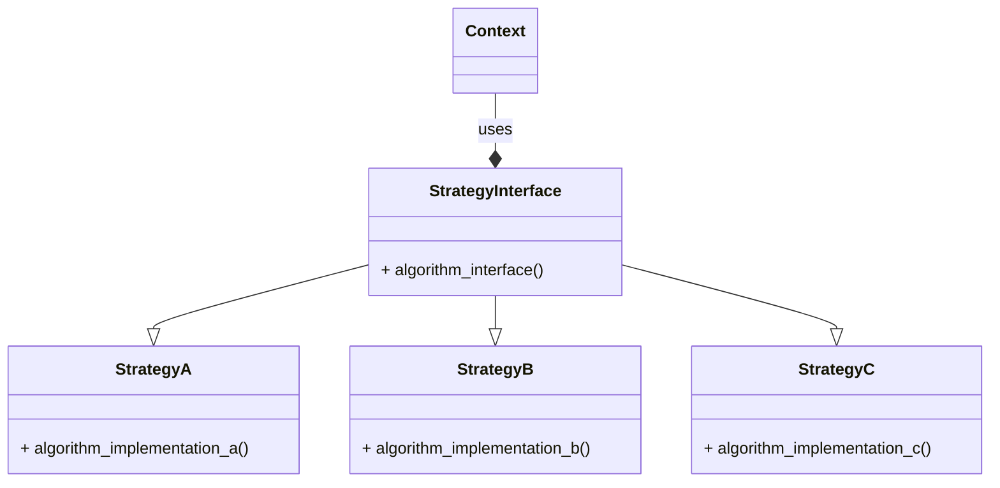

# Strategy

### Type: Behavioral

## Introduction

The strategy pattern (also known as the policy pattern) is a behavioral software design pattern that enables selecting an algorithm at runtime. Instead of implementing a single algorithm directly, code receives run-time instructions as to which in a family of algorithms to use.It is a very common way to use coposition and it use implements the Dependency Inversion Principle.


## Advantages

1. Provides an encapsulation of a set of algorithms that can be referenced by a common interface.

2. Follows the principle that code must not be based on implementations, but interfaces.

3. Helps on using Open closed Principle.

4. Uses Dependency injection, providing less code coupling. 

## Pattern Diagram


## Our Python example

#### Obs

Python does not have interfaces, to workaround it.It's possible to use abstract classes or Protocols.This example uses abstract classes. 

#### Introduction

The code is a part of a RPG game, where each warrior can use differents strategies of attack and defense. 

#### Abstract Classes

1. Create the abstract classes on the "interfaces" file with an attack abstract class and a defense abstract class.
Each has a static method called execute that does the action reciving either strength_points or defense_points.

```
class IAttackStrategy(ABC):
    
    @staticmethod
    @abstractmethod
    def execute(strength_points: float) -> None : pass
    

# Defend Interface
class IDefenseStrategy(ABC):
    
    @staticmethod
    @abstractmethod
    def execute(defense_points: float) -> None : pass

```

#### Concrete Classes

2. Create diferent concrete classes that implements one of the "interfaces":

* EmptyHandedAttackStrategy implments IAttackStrategy interface.
* SwordAttackStrategy implments IAttackStrategy interface.
* ArmsDefenseStrategy implements IDefenseStrategy interface.
* ShieldDefenseStrategy implements IDefenseStrategy interface.

```
class EmptyHandedAttackStrategy(IAttackStrategy):
    
    @staticmethod
    def execute(strength_points: float) -> None:
        power = strength_points + (strength_points / 3)
        print(f'Attacked with the arms, total power of {power}')


class SwordAttackStrategy(IAttackStrategy):
    
    @staticmethod
    def execute(strength_points: float) -> None:
        power = strength_points + (strength_points * 1.35)
        print(f'Attacked with the sword, total power of {power}')
    


class ArmsDefenseStrategy(IDefenseStrategy):
    
    @staticmethod
    def execute(defense_points: float) -> None:
        print(f'Defended {defense_points} points of the attack, using the arms')
        

class ShieldDefenseStrategy(IDefenseStrategy):
    
    @staticmethod
    def execute(defense_points: float) -> None:
        print(f'Defended {defense_points * 2 } points of the attack, using a shield')

```

#### Warrior Class

3. Create the warrior class that recives as arguments:

* name => warrior name.
* strength_points => used on the attack.
* defense_points => used on the defense.
* attack_strategy => an implementation of IAttackStrategy.
* defense_strategy => an implementation of IDefenseStrategy.

methods:

* attack => uses the reciving implementation of the IAttackStrategy interface to attack passing the strength_points.
* defense => uses the reciving implementation of the IDefenseStrategy interface to defend passing the defense_points.

```
@dataclass
class Warrior:
    
    name: str
    strength_points: float
    defense_points: float
    attack_strategy: IAttackStrategy
    defense_strategy: IDefenseStrategy
    
    def attack(self) -> None:
        self.attack_strategy.execute(self.strength_points)
        
    def defend(self) -> None:
        self.defense_strategy.execute(self.defense_points)
    
```

#### The Program

1. Instatiate a poor_warrior that recives the EmptyHandedAttackStrategy and the ArmsDefenseStrategy.
2. Instantiate a royal_warrior that recives the SwordAttackStrategy and the ShieldDefenseStrategy.
3. Execute the functions attack and defend for both warriors

```

if __name__ == '__main__':
    
    poor_warrior = Warrior('vagabond', 75, 40, EmptyHandedAttackStrategy, ArmsDefenseStrategy)
    royal_warrior = Warrior('Lancelot', 120, 80, SwordAttackStrategy, ShieldDefenseStrategy)
    
    poor_warrior.attack()
    royal_warrior.defend()
    
    royal_warrior.attack()
    poor_warrior.defend()
    
```

#### Use cases examples:
1. Authentication system that can recive differnt types of cryptography and decryptography implementations.
2. Shipping system.
3. Discount system.
