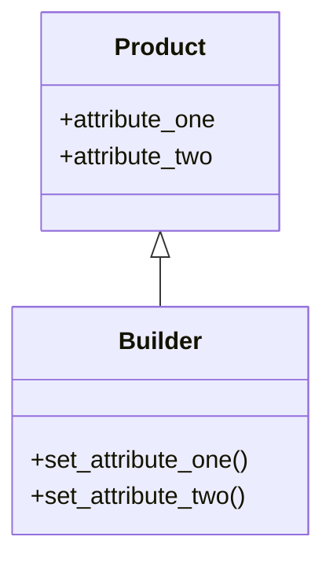

# Simple Builder

### Type: Creational

### Disclaimer

This is not actually a design pattern, altough is the most common way that companies use the builder patter. I'm calling it of simple builder because, unlike the real builder pattern, this "pattern" does not have a builder interface and a director class.

## Introduction

The Builder design patter is meant to provide a second class that will be responsable to instatiate a complex product class that can be build in several ways, creating in each way  diferent form of the final object. In order to do so, this class must have methods that each will be responsible to add an attribute to the instance. 
The methods must return the instance because in that way the client code can chain the methods to build easly the object. The builder class must also have a build method that will be called at the end of the methods chain and will return the object.

## Pattern Diagram



## Our Python example

### Introduction

The program is a FPS game that let the player craft guns combining diferent parts.

#### Product Class

1. Create a dataclass for the gun that contains all the possible gun's parts.

```

@dataclass
class Gun:
    
    brand: str
    elongated_clip: Optional[bool] = None
    scope: Optional[bool] = None
    elongated_stock: Optional[bool] = None
    silincer: Optional[bool] = None
    infrared_sight: Optional[bool] = None
    

```

#### Builder Class

2. Create a dataclass that will be the gun's "Builder Class".

```
@dataclass
class GunBuilder(Gun):
    pass
    
```

#### Chaining Methods

3. For each part that can be added to the gun, creates a method that will add it to the "Builder Class" instance. 
(In this case I'm only passing "true" to the parts that together creates the gun). Return the instance (self).

```
@dataclass
class GunBuilder(Gun):
    
    
    def with_elongated_clip(self) -> None:
        self.elongated_clip = True
        return self
    
    def with_scope(self) -> None:
        self.scope = True
        return self

    def with_elongated_stock(self) -> None:
        self.elongated_stock = True
        return self
    
    def with_silincer(self) -> None:
        self.silincer = True
        return self

    def with_infrared_sight(self) -> None:
        self.infrared_sight = True
        return self

    
```

#### Build Method

4. Create a build method that instatiate a new Gun passing the "Builder Class" instance attributes as the parameters to create it. Return the gun instance.

```
@dataclass
class GunBuilder(Gun):
    
    ...
    
    def build(self) -> Gun:
        return Gun(
            self.brand,
            self.elongated_clip,
            self.scope,
            self.elongated_stock,
            self.silincer,
            self.infrared_sight
        )

```

#### The Program

1. Creates a Ak-74 with scope and silincer using the "Builder Class" and stores it on a variable 
2. Creates a Glock with infrared sight using the "Builder Class" and stores it on a variable
3. Prints both variables on console.

```
if __name__ == '__main__':
    ak = GunBuilder('Ak-74').with_scope().with_silincer().build()
    glock = GunBuilder('Glock').with_infrared_sight().build()
    
    print(ak)
    print(glock)
    
```