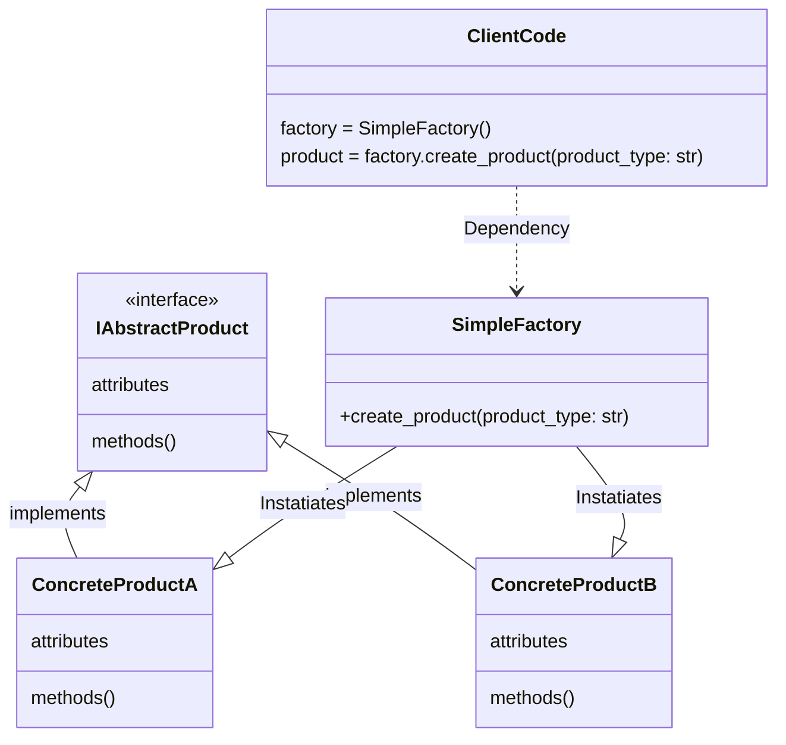

# Simple Factory

### Type: Creational

### Disclaimer:

Simple factory is not actually considere a design pattern, but it's a really good base for understanding two design patterns: "Factory Method" and "Abstract Factory".

## Introduction

Simple Factory is based on a estructure where an abstract class or interface, called the "Product Class" is implemented by other classes, "The Concrete Classes", usally using polymorphism. In this case the goal is to not share the implementations to the client code, and instead  provide a classe that will be responsible to instantiate one of the concrete classes.This class is the factory class.

## Advantages

1. Creates a system with less coupling between the classes, because the client code is not responsible to instatiate the concrete classes.

2. Make easier to add new concrete classes because the client code do not uses the implemantation of the abstract class, but only an instance.

## Pattern Diagram


### Obs:

* The Diagram is render by a third-part library and it can be a little messed.

## Our Python example

#### Base

1. Create class Foe which has health points (int) and can be elemental.

```

class Foe:
    
    """An Enemy that can be atacked with a spell
    """
    
    def __init__(self, name: str, health: int, is_elemental: bool) -> None:
        self.name = name
        self.health = health
        self.is_elemental = is_elemental

    def __str__(self) -> str:
        return f'{self.name} is with {self.health} of health.'

```

#### Abstract Class

2. Create Class Spell that has power (int) of the magic and an abstract method cast that recives a foe.

```
class Spell(ABC):
    
    """A atack that is used in a Foe. 
    It can be stronger or weaker depends on the type of spell and the type of Foe
    """
    
    def __init__(self, power: int) -> None:
        self.power = power
    
    @abstractmethod
    def cast(self, foe: Foe) -> None:
        raise NotImplementedError()

```
#### Concrete Classes

3. Class Striker a spell that when is casted inflicts the power points of damage in the foe, and it can be multiplied by 1.5 if the foe is elemental. Class Flames  that has the power points multiplied by 3 if the foe is not elemental and divided by 2 if it's.

```

class Striker(Spell):
    
    """A physical spell
    """
    
    def __init__(self) -> None:
        super().__init__(70)
        
    def cast(self, foe: Foe) -> None:
        
        if foe.is_elemental:
            self.power *= 1.5
        
        foe.health -= self.power


class Flames(Spell):
    
    """An Elemental spell
    """
    
    def __init__(self) -> None:
        super().__init__(40)
    
    
    def cast(self, foe: Foe) -> None:
            
        if foe.is_elemental:
            self.power /= 2
        else:
            self.power *= 3
        
        foe.health -= self.power

```

### Enum and Factory Class

4. Creates an enum with all the concrete classes and the factory class which has only an static method get_spell who recives one of the enum options and returns the class instance according to it.

```

class Spells(Enum):
    Flames = 'flames'
    Striker= 'striker'


class SpellFactory:
    
    @staticmethod
    def get_spell(spell_type: Spells) -> Spell:

        if(spell_type == Spells.Striker):
            return Striker()
        
        if(spell_type == Spells.Flames):
            return Flames()
        
        assert 0, 'Error'

```

### The Program

creates a elemental Foe and a non-elemental one, then randomly creates a spell, then randomly pick a Foe as well to be atacked.
After the atack the program prints the two foes with their current health points 

```
if __name__ == '__main__':
    
    from random import choice
    
    physical_foe = Foe(name='Orc', health=700, is_elemental=False)
    elemental_foe = Foe(name='Dark elf' ,health=300, is_elemental=True)
    
    spell = SpellFactory.get_spell(choice([s for s in Spells]))
    spell.cast(choice([physical_foe, elemental_foe]))
    
    print(physical_foe)
    print(elemental_foe)

```

### Obs

* This example uses static methods to make it simpler, but a real world code may uses objects.
