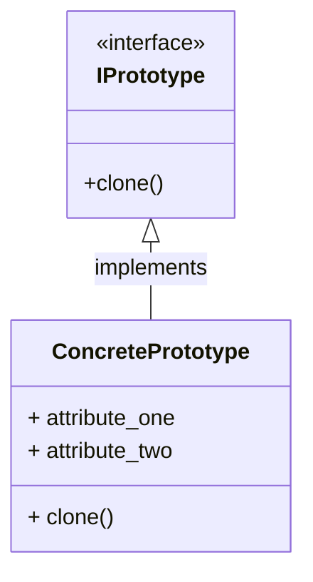

# Prototype

### Type: Creational

## Introduction

The Prototype is a design pattern listed on the GOF book, like it's name says, it meant to provide a portotype (base) object of a class, with initial values setted to it's attributes. The client code will use this prototype object as a base to create a new object , only replacing the values of attributes that are necessary.

## Pattern Diagram



## Our Python example

### Introduction

The program is an Employee register that provides a class role and a class employee, every employee must have a role and more attributes. 

#### Role Class

1. Create a class Role with the attribute name.

```py
@dataclass 
class Role:
    name : str
    
    def __str__(self) -> str:
        return self.name

```
#### Employee Class

2. Create a class Employee with that will recive a Role instance as it's attribute role and the following attributes:
*  name: str
*  register_date: datetime
*  hour_salary: float
*  working_days: int
*  role: Role
*  month_bonus: float

```py
@dataclass
class Employee:
    
    name: str
    register_date: datetime
    hour_salary: float
    working_days: int
    role: Role
    month_bonus: float
    
    @property
    def payment(self) -> float:
        return self.hour_salary * 8 * self.working_days + self.month_bonus 
    

    def __str__(self) -> str:
        return f'{self.name} is a {self.role}, he/she worked {self.working_days} days and will earn {self.payment} this month'

```

#### The Clone method

3. To implement the prototype pattern it's need to create a clone method on the product class "Employee".The clone method must clone the instance "self" and return the clone.

```py
@dataclass
class Employee:
    
    ...

    def clone(self) -> Employee:
        return deepcopy(self)
    

```

#### The Program

1. Creates a prototype for all the employees that work on the administrative office.
2. Clones the prototype to craete an actually employee "john" and changes the attribute "name" to "John".
3. Does the exactly same thing to another employee that works on the office "Mary".

```py
if __name__ == '__main__':
    
    adm = Role('Administrative Assistant')
    assistant = Employee('worker', register_date=datetime.now(), hour_salary=7, working_days=21, role=adm, month_bonus=400)
    
    john = assistant.clone()
    john.name = 'John'
    
    mary = assistant.clone()
    mary.name = 'Mary'
    
    print(john)
    print(mary)

```

##### Notes:

* Notice that all the employees that work on the adm office have the same caracteristcs except from the name. (each has it's own name). The proptotype makes easy to instatiate the objects. Imagine an office with fifty employees with the same attributes, there is no need to walkthrough the same instantiation proccess over and over for each one. 


