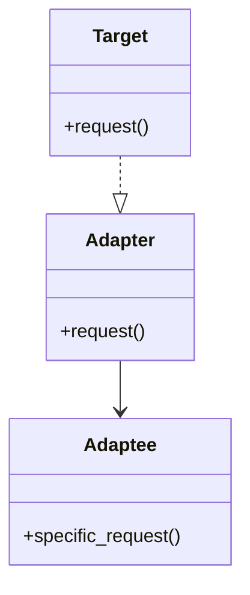

# Adpter

### Type: Structural

## Introduction

The Adpter pattern allows two incompatible interfaces to work together.If the client code is already using a specif interface to do some procedure, there is no need to change everywhere that this interface is used to apply a new class or interface.<br>
The Adapter class implements a Target interface that is compatible with the client code and use the interface methods to execute alikely methods from the new class, in this way the client code can stick to the old convession names and algorithms.

### Obs:

* The Adapter class does not add or remove anything. It's only meant to provide an adptation.

* There is two ways to implement the Adapter pattern, one using inheritance and other using composition.(This example uses composition).

## Advantages

*.Loose coupling.

* Encapsulate the logic from the client code.

* It allows us to use code from third parties relatively seamlessly. There’s no need to change existing interfaces to use new code. Just implement an adapter for it.

## Disadvantages

* The class adapter pattern (with inheritance) may generate a Dimond Problem,

## Pattern Diagram

## Our Python example

### Obs: 

* Python does not have interfaces, to workaround it.It's possible to use abstract classes or Protocols.This example uses Protocols. 

### Introduction

A authentication program that currently uses the JWT to generate and validate tokens, but needs to be refactored with the use of Hash token.<br>
The Client code (LoginScreen class) is already using an interface compatible with the JWT in order to implement the authentication system.

#### Target Interface (ITokenService)

1. Creates a target interface. (target_protocol.py)

```py
from typing import Protocol

class ITokenService(Protocol):
    
    def get_token(self) -> str: pass
    
    def verify(self) -> bool: pass
    
```

#### HashToken & JWT

2. Creates two classes that implement different methods, but are result wise alikly.

(hash_token.py)

```py
from dataclasses import dataclass
from typing import ClassVar, List
import random


@dataclass
class HashToken:
    
    tokens : ClassVar[List[str]] = []
    
    @classmethod
    def generate_token(cls) -> str:
        token = random.getrandbits(128)
        
        cls.tokens.append(token)
        
        print('A Hash token was generated')
        
        return token
    
    @classmethod
    def validate(cls, token: str) -> bool:
        
        if token in cls.tokens:
            print('Hash Token is valid')
            return True
        
        print('Invalid Hash Token')
        return False

```

(jwt.py)

```py
from dataclasses import dataclass
from typing import ClassVar, List
import uuid

@dataclass
class JwtToken:
    
    tokens : ClassVar[List[str]] = []
    
    @classmethod
    def get_token(cls) -> str:
        token = uuid.uuid4()
        
        cls.tokens.append(token)
        
        print('A Hash token was generated')
        
        return token
    
    @classmethod
    def verify(cls, token: str) -> bool:
        
        if token in cls.tokens:
            print('Token is valid')
            return True
        
        print('Invalid Token')
        return False
        
```

#### Adapter

3. Creates an adapter class that adapts the HashToken to the JWT format, because the client code is already using the JWT format.(adapter.py)

```py
from dataclasses import dataclass
from modules.hash_token import HashToken

@dataclass
class HashTokenAdapter:
    
    @classmethod
    def get_token(cls) -> str:
        return HashToken.generate_token()
    
    @classmethod
    def verify(cls, token: str) -> bool:
        return HashToken.validate(token)
```

#### The Program (Client code)

1. Creates a LoginScreen that recives a token_services and has an execute method to authenticate the user.
2. Instatiate a a LoginScreen using the JWT and another passing the Hash adapter.
3. Calls the execute method in both LoginScreen instances. 

(main.py)

```py
from dataclasses import dataclass
from modules.jwt import JwtToken
from modules.target_protocol import ITokenService
from modules.adapter import HashTokenAdapter

@dataclass
class LoginScreen:
    
    token_service: ITokenService
    token: str = None
    
    def execute(self) -> None:
        
        if self.token:
            validated_token = self.token_service.verify(self.token)
            
            if not validated_token:
                print('Acess Denied!')

            print('User is already logged, moving to home page')
            return
        
        self.token = self.token_service.get_token()
        print('User has been logged, moving to home page')


if __name__ == '__main__':
    
    # Using JwtToken
    login_screen = LoginScreen(JwtToken)
    
    login_screen.execute()
    print('####')
    login_screen.execute()
    
    print('--------------------------------')
    print()
    
    # Using HashTokenAdapter
    login_screen_hash = LoginScreen(HashTokenAdapter)
    
    login_screen_hash.execute()
    print('####')
    login_screen_hash.execute()

```

### Obs:

This example uses static methods to be simpler, but a real life code can and will probably use objects.
