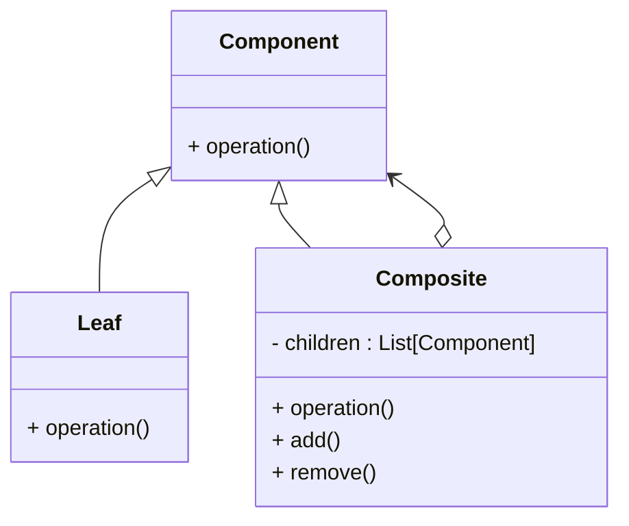

# Composite

### Type: Structural

## Introduction

&nbsp;The composite pattern describes a group of objects that are treated the same way as a single instance of the same type of object. The intent of a composite is to "compose" objects into tree structures to represent part-whole hierarchies. Implementing the composite pattern lets clients treat individual objects and compositions uniformly.<br>
&nbsp;The pattern consists in the three following classes:

1. Component: It's the abstract class (or interface) that both the individual objects and the composed objects implements in order to be treat equaly.

2. Leaf: This class represents an individual object, the object that is in the final of the hierarchical tree.

3. The Composite class: The instances of this class acts as a container to Leaf objects, receiving one or more leaves.

&nbsp; The Composite pattern is commonly represented by an hierarchical binary tree, where each of the nodes is either a Composite object or a Leaf object. The pattern also uses recursion to access the further nodes of the tree.  

## Advantages

1. Provides a simple Api to the client.

2. Adding new kinds of composite is easy.

## Disadvantages

1. Add more complexity to the code.

2. Breaks the Interface Segregation Principle (ISP) depending on the implementation.

3. Can cause unexpected side effects.

4. Can make the code slower if the common operation is a heavy calculation or something alike.

## Pattern Diagram

## Our Python example

#### Obs

* Python does not have interfaces, to workaround it.It's possible to use abstract classes or Protocols.This example uses abstract classes. 

### Introduction

&nbsp;Yan is a software engineer at a delivery company, his boss asks him to make a program that calculates the amount of products in a truck, before the truck leaves the company. Boss of it also specifies that the quantity of products must be calculated according to each product inside the boxes.<br>
&nbsp;Yan decides that the best way to solve this problem is to use the Composite pattern to calculate the quantity of each product, and if the product is a box of products, the program will add up the amount of each product inside the box and then consider the result as the quantity of the box.

#### Component Abstract Class

1. Create an abstract class with the common methods to be implemented by both the Leaf class and the Composite class. (component.py)

```py
from abc import ABC

class ProductComponent(ABC):
    
    def get_quantity(self) -> int: pass


```

#### Leaf Class

2. Create a class that will represent a non-compound product.(leaf.py)

```py
from dataclasses import dataclass
from modules.component import ProductComponent

@dataclass
class ProductLeaf(ProductComponent):
    
    name: str
    quantity: int
    
    def get_quantity(self) -> int:
        return self.quantity

```

#### Composite Class

3. Create the Composite class. (composite.py)

```py
from dataclasses import dataclass, field
from functools import reduce
from modules.component import ProductComponent
from typing import List

@dataclass
class ProductComposite(ProductComponent):
    
    __parents : List[ProductComponent] = field(default_factory=list)
    
    def add(self, *products: List[ProductComponent]) -> None:  
        for product in products:
            self.__parents.append(product)


    def remove(self, product: ProductComponent) -> None:
        self.__parents.remove(product)
        
        
    def get_quantity(self) -> int:  
        return reduce(lambda sum, parent: sum + parent.get_quantity(), self.__parents, 0)

```

#### The Program

1. The program instiates a bunch of leaves objects and "put them inside" a composite instance.
2. Create more two porduct leaves and add them to another composite instance.
3. Add the second composite instance inside the first one.
4. Call the get_quantity method of the first composite instance that returns the sum of all products' quantity. 


```py
from modules.leaf import ProductLeaf
from modules.composite import ProductComposite


if __name__ == '__main__':
    
    playstation_5 = ProductLeaf('PlayStation 5', 700)
    smartphone = ProductLeaf('Smartphone', 500)
    xbox_series_x = ProductLeaf('Xbox series X', 500)
    
    product_container = ProductComposite()
    product_container.add(playstation_5, smartphone, xbox_series_x)

    tablet = ProductLeaf('Tablet', 300)
    head_phone = ProductLeaf('HeadPhone', 200)
    second_product_container = ProductComposite()
    second_product_container.add(tablet, head_phone)
    product_container.add(second_product_container)

    print(product_container)
    print(product_container.get_quantity())
    
    
```


* Obs:

Notice here that a ProductComposite instance act like a box inside the truck, and in this example one box is put inside another, that also has individual products.  
